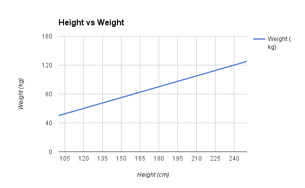

# Linear Regression Applications

## What is Linear Regression?

When you start looking into linear regression, things can get very confusing.

The reason is because linear regression has been around for so long (more than 200 years). 
It has been studied from every possible angle and often each angle has a new and different name.

Linear regression is a **linear model**, e.g. a model that assumes a linear relationship 
between the input variables *(x)* and the single output variable *(y)*. 

When there is a single input variable (x), the method is referred to as simple **linear regression**. 
When there are multiple input variables, literature from statistics often refers to the method as **multiple linear regression**.

Simple regression: `y = B0 + B1*x`

In higher dimensions when we have more than one input (x), the line is called a plane or a hyper-plane. 
The representation therefore is the form of the equation and the specific values used for the coefficients.

### 1. Simple Linear Regression

With simple linear regression when we have a single input, we can use statistics to estimate the coefficients.

This requires that you calculate statistical properties from the data such as means, standard deviations, correlations and covariance. All of the data must be available to traverse and calculate statistics.

### 2. Ordinary Least Squares

*When we have more than one input* we can use Ordinary Least Squares to estimate the values of the coefficients.

The Ordinary Least Squares procedure seeks to minimize the sum of the squared residuals. This means that given a regression line through the data we calculate the distance from each data point to the regression line, square it, and sum all of the squared errors together. This is the quantity that ordinary least squares seeks to minimize.

### 3. Gradient Descent

*When there are one or more inputs* you can use a process of optimizing the values of the coefficients by iteratively minimizing the error of the model on your training data.

This operation is called Gradient Descent and works by starting with random values for each coefficient. The sum of the squared errors are calculated for each pair of input and output values. A learning rate is used as a scale factor and the coefficients are updated in the direction towards minimizing the error. The process is repeated until a minimum sum squared error is achieved or no further improvement is possible.

When using this method, you must select a **learning rate (alpha) parameter** that determines the size of the improvement step to take on each iteration of the procedure.

### 4. Regularization

There are extensions of the training of the linear model called regularization methods. These seek to both minimize the sum of the squared error of the model on the training data (using ordinary least squares) but also to reduce the complexity of the model.

1. **Losso Regression**: where Ordinary Least Squares is modified to also minimize the absolute sum of the coefficients (*called L1 regularization*).
2. **Ridge Regression**: where Ordinary Least Squares is modified to also minimize the squared absolute sum of the coefficients (*called L2 regularization*).

## Application Areas

- Forecasting
- Predicting House & Car Prices

## Our Examples

1. [Car Price Prediction 1](Car%20Price%20Prediction.ipynb)

