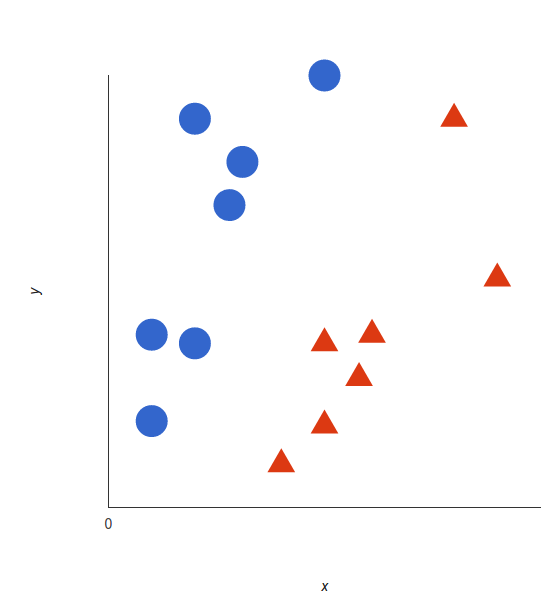
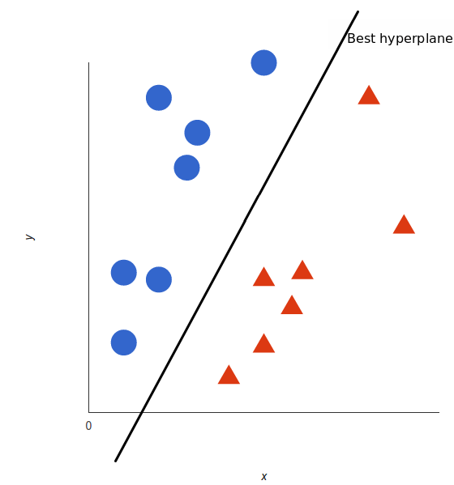
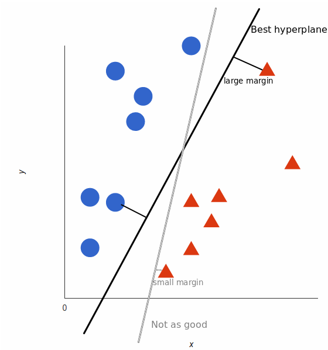
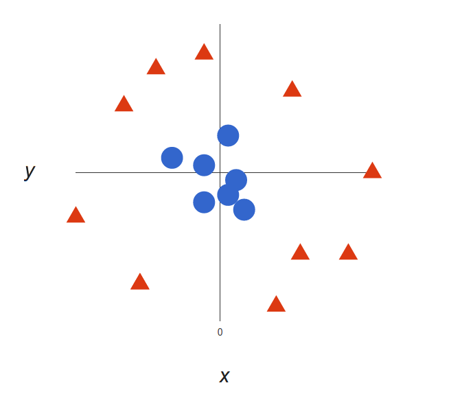
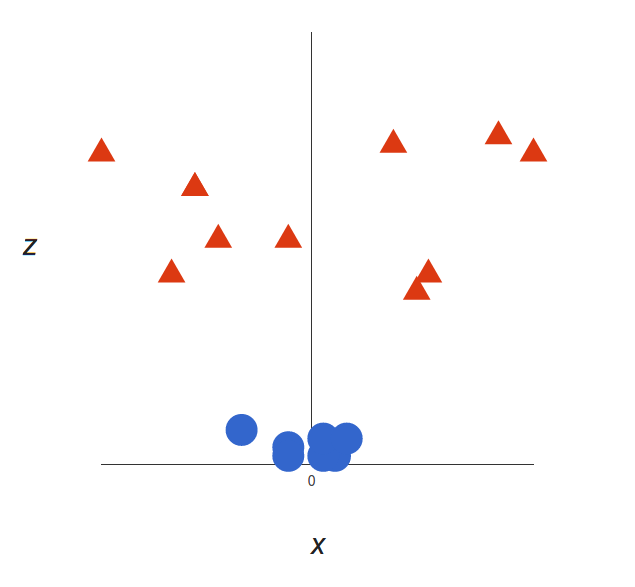
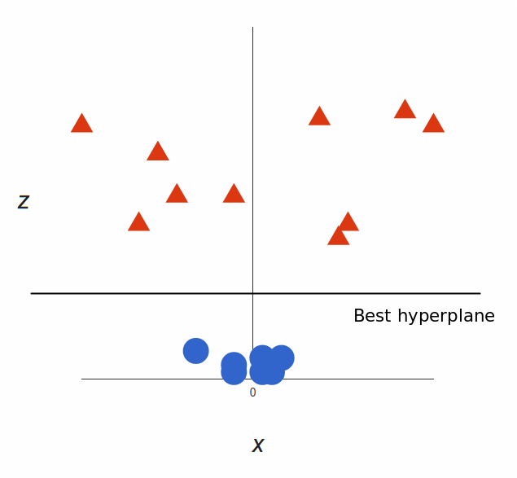

# Support Vector Machines

A support vector machine (SVM) is a **supervised machine learning model** that uses *classification algorithms* for two-group classification problems.

## How Does SVM Work?

The basics of Support Vector Machines and how it works are best understood with a simple example. Let’s imagine we have two tags: **red** and **blue**, and our data has two features: x and y. We want a classifier that, given a pair of (x,y) coordinates, outputs if it’s either **red** or **blue**. We plot our already labeled training data on a plane:

A support vector machine takes these data points and outputs the hyperplane (which in two dimensions it’s simply a line) that best separates the tags. This line is the **decision boundary**: anything that falls to one side of it we will **classify** *as blue*, and anything that falls to the *other as red*.

But, what exactly is the best hyperplane? For SVM, it’s the one that maximizes the margins from both tags. In other words: the hyperplane (remember it's a line in this case) whose distance to the nearest element of each tag is the largest.

For more information about SVM, you can also watch this youtube video.

## Nonlinear Data

Now this example was easy, since clearly the data was linearly separable — we could draw a straight line to separate **red** and **blue**. Sadly, usually things aren’t that simple. Take a look at this case:

It’s pretty clear that there’s not a linear decision boundary (a single straight line that separates both tags). However, the vectors are very clearly segregated and it looks as though it should be easy to separate them.

So here’s what we’ll do: we will add a third dimension. Up until now we had two dimensions: x and y. We create a new z dimension, and we rule that it be calculated a certain way that is convenient for us: z = x² + y² (you’ll notice that’s the equation for a circle).

This will give us a three-dimensional space. Taking a slice of that space, it looks like this:

That’s great! Note that since we are in three dimensions now, the hyperplane is a plane parallel to the x axis at a certain z (let’s say z = 1).

What’s left is mapping it back to two dimensions:

And there we go! Our decision boundary is a circumference of radius 1, which separates both tags using SVM. Check out this 3d visualization to see another example of the same effect:

###### [Source](https://monkeylearn.com/blog/introduction-to-support-vector-machines-svm)